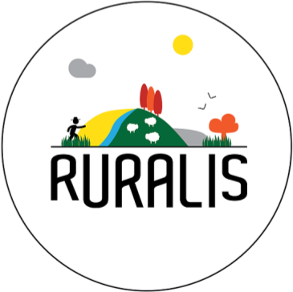

# RURALIS®

Ruralis, un jeu pédagogique sur les infrastructures agro-écologiques

Ruralis est un jeu de société, qui permet de réfléchir sur l’implantation d'IAE dans une exploitation agricole, et d'en appréhender les différents enjeux.

## Environment variable
MONGODB_URI  : link to the database

## Travis

## Setup
You need Node.js (version >= 10) & npm. Once installed simply run `npm install` followed by `npm start` and you should be running.

## Tests
You can run `npm test` to run the different unit tests of the routes

## Swagger
The API is documented with Swagger, you can access it with <server url>/api-docs
  
Your app is ready to be deployed!
